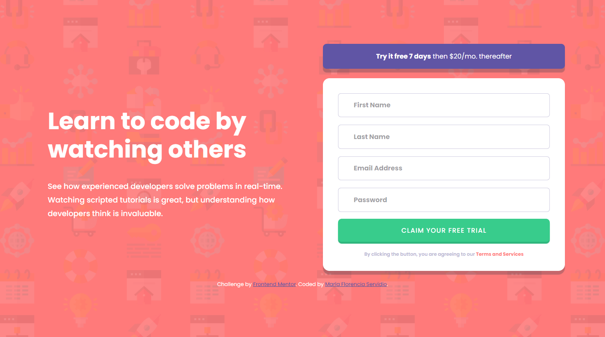

# Frontend Mentor - Intro component with sign up form solution

This is a solution to the [Intro component with sign up form challenge on Frontend Mentor](https://www.frontendmentor.io/challenges/intro-component-with-signup-form-5cf91bd49edda32581d28fd1). Frontend Mentor challenges help you improve your coding skills by building realistic projects. 

## Table of contents

- [Overview](#overview)
  - [The challenge](#the-challenge)
  - [Screenshot](#screenshot)
  - [Links](#links)
- [My process](#my-process)
  - [Built with](#built-with)
  - [What I learned](#what-i-learned)
  - [Continued development](#continued-development)
  - [Useful resources](#useful-resources)
- [Author](#author)
- [Acknowledgments](#acknowledgments)

## Overview

### The challenge

Users should be able to:

- View the optimal layout for the site depending on their device's screen size
- See hover states for all interactive elements on the page
- Receive an error message when the `form` is submitted if:
  - Any `input` field is empty. The message for this error should say *"[Field Name] cannot be empty"*
  - The email address is not formatted correctly (i.e. a correct email address should have this structure: `name@host.tld`). The message for this error should say *"Looks like this is not an email"*

### Screenshot




### Links

- Solution URL: [Frontend Mentor](https://www.frontendmentor.io/solutions/intro-component-with-sign-up-form-lPIWTZOP-5)
- Live Site URL: [Vercel](https://intro-component-with-signup-form-amber-ten.vercel.app/)

## My process

### Built with

- Semantic HTML5 markup
- CSS custom properties
- Flexbox
- Mobile-first workflow
- Javascript

### What I learned

This challenge help me practice building a responsive form with a client side validation using HTML5/CSS3 and Javascript. It is optimized for different devices' screen sizes and interactive elements are implemented.

Some code snippet below:

```html
<form class="form__trial shadow" id="trial" action="" method="post">

        <input id="form__trial-fname" class="form__trail-input" type="text" placeholder="First Name" required>
        <div id="error__fname" class="error__message hidden"></div>

        <input id="form__trial-lname" class="form__trail-input" type="text" placeholder="Last Name" required>
        <div id="error__lname" class="error__message hidden"></div>

        <input id="form__trial-email" class="form__trail-input" type="email" placeholder="Email Address" required>
        <div id="error__email" class="error__message hidden"></div>

        <input id="form__trial-password" class="form__trail-input" type="password" placeholder="Password" required>
        <div id="error__password" class="error__message hidden"></div>
        
        <button class="form__btn" type="submit">Claim your free trial</button>

        <p class="form__text">By clicking the button, you are agreeing to our <span>Terms and Services</span></p>
      </form>
```

```js
function validate(){

        let result = true;

        let valueFName = inputName[0].value.trim();
        if(valueFName == null || valueFName.length == 0){
            showError(inputName[0], errorFName, "First name cannot be empty"); 
            result = false;  
        } else {
            showSuccess(inputName[0], errorFName);
        };

       let valueLName = inputName[1].value.trim();
       if(valueLName == null || valueLName.length == 0){
            showError(inputName[1], errorLName, "Last name cannot be empty");
            result = false;     
        } else {
            showSuccess(inputName[1], errorLName);
        };

        let valueEmail = inputEmail.value.trim();
        if(!(/^\w+([\.-]?\w+)*@(?:|hotmail|outlook|yahoo|live|gmail)\.(?:|com|ar)+$/.test(valueEmail))){
            showError(inputEmail, errorEmail, "Looks like this is not an email");
            result = false;            
        } else {
            showSuccess(inputEmail, errorEmail);
        };

        let valuePassword = inputPassword.value.trim();
        if(valuePassword == null || valuePassword.length == 0){
            showError(inputPassword, errorPassword, "Password cannot be empty");
            result = false;            
        } else {
            showSuccess(inputPassword, errorPassword);
        };

        return result;
    };
```

### Continued development

My actual and future plans are to keep on practising and improving my Javascript and CSS skills. I want to build better and optimized websites and web apps, focusing on a mobile-first approach.

### Useful resources

- [FreeCodeCamp](https://www.freecodecamp.org/news/learn-javascript-form-validation-by-making-a-form/) - This helped me to get some tips on how to validate a form from the client side.

## Author

- Behance - [María Florencia Servidio](https://www.behance.net/mflorservidio88)
- Frontend Mentor - [@Maflo88](https://www.frontendmentor.io/profile/Maflo88)

## Acknowledgments

Thanks to W3Schools for their tutorials and examples. :D
And thanks to FrontEnd Mentor for their awesome challenges.
